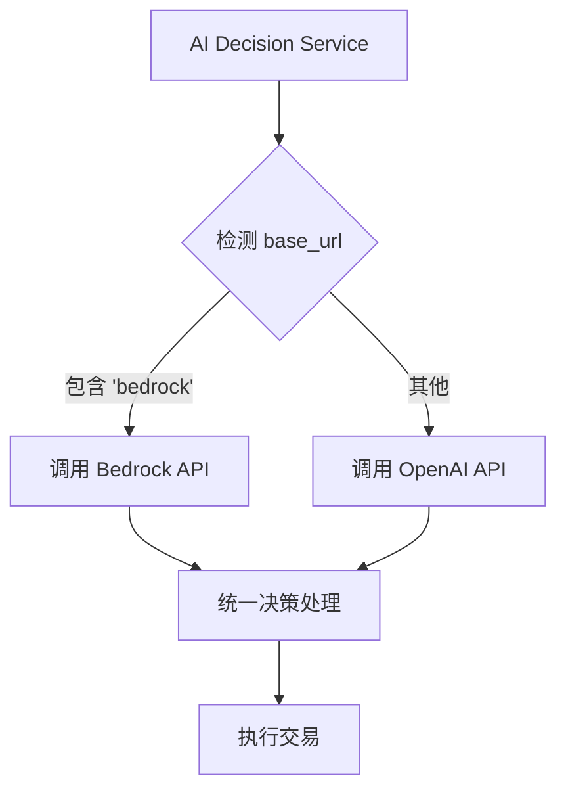
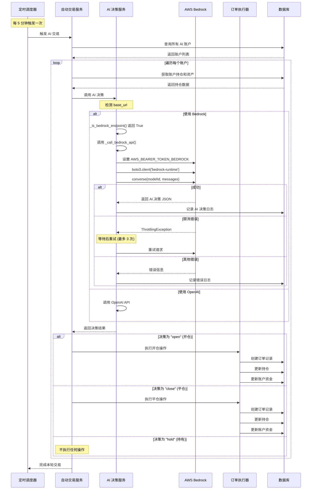
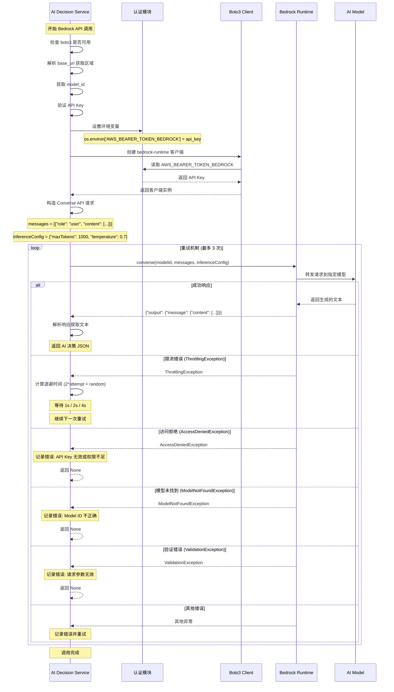
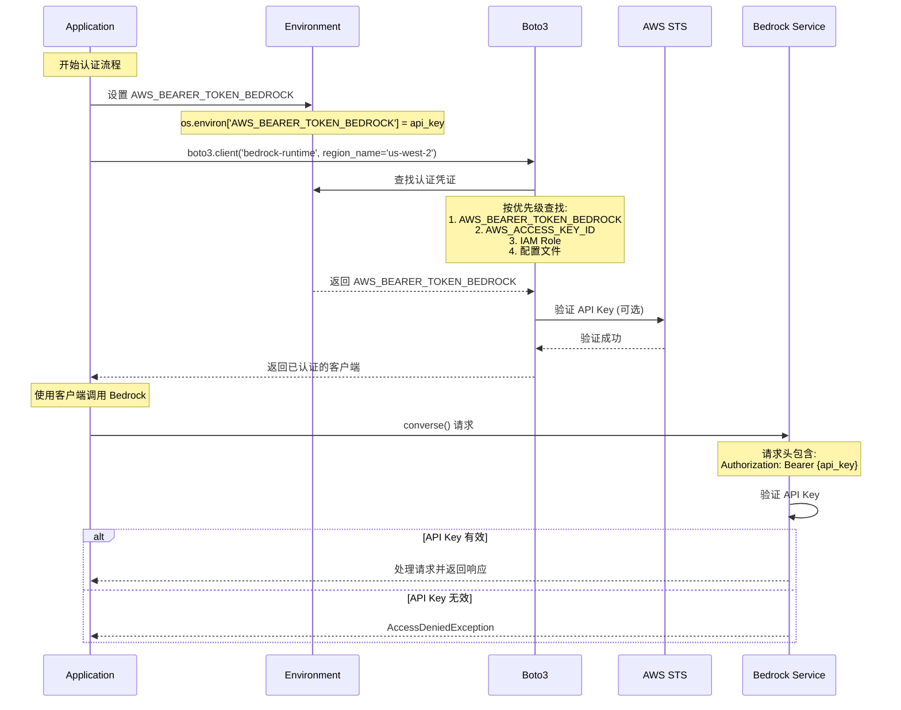
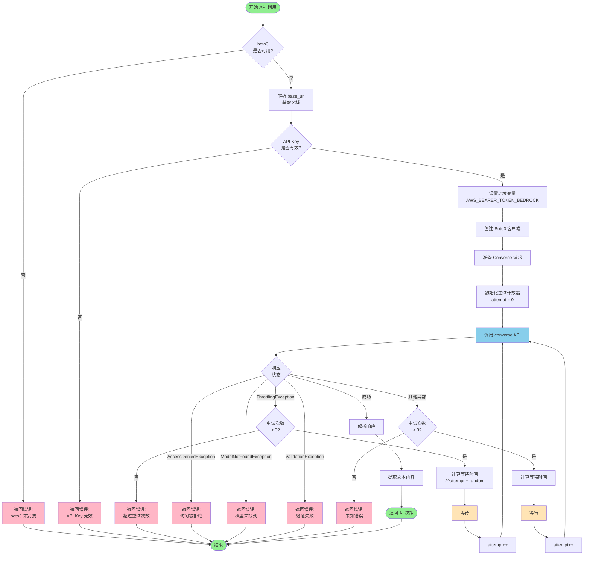

# AWS Bedrock 集成完整指南

> **版本**: v2.0.0  
> **更新日期**: 2025-11-02  
> **状态**: ✅ 已完成并测试

---

## 目录

1. [背景介绍](#1-背景介绍)
2. [模型选择与兼容性](#2-模型选择与兼容性)
3. [账户配置指南](#3-账户配置指南)
4. [API 调用链时序图](#4-api-调用链时序图)
5. [常见问题 (FAQ)](#5-常见问题-faq)

---

## 1. 背景介绍

### 1.1 项目背景

本项目是一个加密货币自动交易系统，支持 AI 驱动的交易决策。在早期版本中，系统仅支持 OpenAI 兼容的 API 接口。为了提供更多选择和更好的性能，我们集成了 AWS Bedrock 服务。

### 1.2 为什么选择 AWS Bedrock？

**优势**：
- ✅ **多模型支持**: 可使用 Claude、Qwen、DeepSeek 等多种先进模型
- ✅ **统一接口**: Bedrock Converse API 提供统一的调用方式
- ✅ **简化认证**: 使用 API Key 认证，无需配置复杂的 AWS IAM
- ✅ **高可用性**: AWS 全球基础设施保障服务稳定性
- ✅ **成本优化**: 按需付费，可根据需求选择不同价位的模型
- ✅ **合规安全**: 符合企业级安全和合规要求

### 1.3 集成特性

本次集成实现了以下核心功能：

| 特性 | 说明 |
|------|------|
| **Converse API** | 使用统一的 Bedrock Converse API，无需为每个模型编写不同代码 |
| **API Key 认证** | 通过 `AWS_BEARER_TOKEN_BEDROCK` 环境变量进行认证 |
| **多模型支持** | 支持 Claude Sonnet 4.5、Qwen 3、DeepSeek 3.1 |
| **默认区域** | us-west-2（可配置其他区域） |
| **自动重试** | 遇到限流或临时错误时自动重试（最多 3 次） |
| **错误处理** | 完善的错误日志和异常处理机制 |
| **向后兼容** | 与现有 OpenAI API 配置完全兼容，可同时运行 |

### 1.4 技术架构

```
┌─────────────────────────────────────────────────────────────┐
│                     Trading System                          │
│                                                             │
│  ┌──────────────┐         ┌──────────────┐                │
│  │   Frontend   │────────▶│   Backend    │                │
│  │   (React)    │         │   (FastAPI)  │                │
│  └──────────────┘         └──────┬───────┘                │
│                                   │                         │
│                    ┌──────────────┴──────────────┐         │
│                    │                             │         │
│           ┌────────▼────────┐         ┌─────────▼────────┐│
│           │  AI Decision    │         │   Order          ││
│           │    Service      │         │  Executor        ││
│           └────────┬────────┘         └──────────────────┘│
│                    │                                       │
│      ┌─────────────┴─────────────┐                       │
│      │                           │                       │
│ ┌────▼──────┐            ┌───────▼────────┐             │
│ │  OpenAI   │            │  AWS Bedrock   │             │
│ │    API    │            │  Converse API  │             │
│ └───────────┘            └────────────────┘             │
└─────────────────────────────────────────────────────────────┘
```

### 1.5 代码修改概览

本次集成主要修改了以下文件：

1. **`backend/services/ai_decision_service.py`** (核心修改)
   - 新增 `_is_bedrock_endpoint()`: 检测是否使用 Bedrock
   - 新增 `_call_bedrock_api()`: 调用 Bedrock Converse API
   - 修改 `call_ai_for_decision()`: 自动路由到 Bedrock 或 OpenAI

2. **`backend/pyproject.toml`** (依赖更新)
   - 添加 `boto3>=1.40.0` 依赖

3. **文档** (新增)
   - 本文档及其他相关文档

---

## 2. 模型选择与兼容性

### 2.1 支持的模型

本系统支持以下三种 AWS Bedrock 模型：

#### 🥇 Claude Sonnet 4.5 (推荐)

**Model ID**: `global.anthropic.claude-sonnet-4-5-20250929-v1:0`

**特点**:
- 最新的 Claude 模型，性能优异
- 强大的推理和理解能力
- 适合复杂的交易决策场景
- 对中英文都有良好支持

**推荐场景**: 
- ✅ 生产环境日常交易
- ✅ 需要高质量决策
- ✅ 预算充足的场景

---

#### 🥈 Qwen 3

**Model ID**: `qwen.qwen3-235b-a22b-2507-v1:0`

**特点**:
- 阿里巴巴开发的大模型
- 235B 参数规模
- 对中文理解特别优秀
- 适合处理中文新闻和市场分析

**推荐场景**: 
- ✅ 主要关注中文市场信息
- ✅ 需要大参数模型能力
- ✅ 复杂的推理和分析任务

---

#### 🥉 DeepSeek 3.1

**Model ID**: `deepseek.v3-v1:0`

**特点**:
- DeepSeek V3.1 大模型
- 高性能推理能力
- 擅长代码理解和逻辑推理
- 性价比较高

**推荐场景**: 
- ✅ 需要高性能推理
- ✅ 涉及复杂逻辑的交易策略
- ✅ 追求性价比

---

### 2.2 模型对比表

| 维度 | Claude Sonnet 4.5 | Qwen 3 | DeepSeek 3.1 |
|------|------------------|--------|--------------|
| **Model ID** | `global.anthropic.claude-sonnet-4-5-20250929-v1:0` | `qwen.qwen3-235b-a22b-2507-v1:0` | `deepseek.v3-v1:0` |
| **参数规模** | 未公开 | 235B | 未公开 |
| **中文支持** | ⭐⭐⭐⭐ 优秀 | ⭐⭐⭐⭐⭐ 优秀 | ⭐⭐⭐ 良好 |
| **英文支持** | ⭐⭐⭐⭐⭐ 优秀 | ⭐⭐⭐⭐ 优秀 | ⭐⭐⭐⭐ 优秀 |
| **推理能力** | ⭐⭐⭐⭐⭐ 优秀 | ⭐⭐⭐⭐ 优秀 | ⭐⭐⭐⭐⭐ 优秀 |
| **响应速度** | ⭐⭐⭐⭐ 快 | ⭐⭐⭐ 中等 | ⭐⭐⭐⭐ 快 |
| **成本** | 💰💰💰 较高 | 💰💰 中等 | 💰💰 中等 |
| **推荐度** | ⭐⭐⭐⭐⭐ | ⭐⭐⭐⭐ | ⭐⭐⭐⭐ |

### 2.3 与 OpenAI 的兼容性

#### 2.3.1 共存模式

AWS Bedrock 和 OpenAI API 可以在同一系统中**完全共存**，互不干扰：



#### 2.3.2 自动检测逻辑

系统通过 `base_url` 自动判断使用哪种 API：

```python
def _is_bedrock_endpoint(base_url: str) -> bool:
    """检测是否使用 Bedrock"""
    if not base_url:
        return False
    base_url_lower = base_url.lower()
    return "bedrock" in base_url_lower or "amazonaws.com" in base_url_lower
```

**判断规则**:
- `base_url` 包含 "bedrock" → 使用 Bedrock
- `base_url` 包含 "amazonaws.com" → 使用 Bedrock  
- 其他情况 → 使用 OpenAI 兼容 API

#### 2.3.3 配置示例对比

**OpenAI 配置**:
```json
{
  "name": "GPT-4 Trader",
  "base_url": "https://api.openai.com/v1",
  "model": "gpt-4",
  "api_key": "sk-...",
  "initial_capital": 10000.0,
  "account_type": "AI"
}
```

**Bedrock 配置**:
```json
{
  "name": "Claude Sonnet 4.5 Trader",
  "base_url": "bedrock://us-west-2",
  "model": "global.anthropic.claude-sonnet-4-5-20250929-v1:0",
  "api_key": "your-bedrock-api-key",
  "initial_capital": 10000.0,
  "account_type": "AI"
}
```

#### 2.3.4 同时运行多个账户

您可以创建多个账户，每个使用不同的 AI 服务：

```
账户 1: GPT-4 (OpenAI)
账户 2: Claude Sonnet 4.5 (Bedrock)
账户 3: Qwen 3 (Bedrock)
账户 4: DeepSeek 3.1 (Bedrock)
```

这样可以：
- ✅ 对比不同模型的交易表现
- ✅ 分散风险
- ✅ 找到最适合的模型
- ✅ 实现模型组合策略

### 2.4 模型切换

#### 快速切换模型

只需修改账户配置中的 `model` 字段即可切换模型，无需重启系统。

**通过前端界面**:
1. 进入账户设置
2. 修改 "模型" 字段
3. 填入新的 Model ID
4. 保存

**通过 API**:
```bash
curl -X PUT http://localhost:8000/api/accounts/{account_id} \
  -H "Content-Type: application/json" \
  -d '{
    "model": "qwen.qwen3-235b-a22b-2507-v1:0"
  }'
```

---

## 3. 账户配置指南

### 3.1 前置准备

#### 3.1.1 安装依赖

首先确保安装了 boto3：

```bash
cd backend
pip install boto3>=1.40.0
```

或使用 uv：

```bash
cd backend
uv pip install boto3
```

#### 3.1.2 获取 Bedrock API Key

**步骤**:

1. **登录 AWS 控制台**
   - 访问: https://console.aws.amazon.com/

2. **导航到 Amazon Bedrock**
   - 在服务搜索框输入 "Bedrock"
   - 点击 "Amazon Bedrock"

3. **创建 API Key**
   - 在左侧菜单选择 "API Keys"
   - 点击 "Create API Key"
   - 输入 API Key 名称（如 "Trading Bot Key"）
   - 点击 "Create"

4. **保存 API Key**
   - ⚠️ **重要**: API Key 只会显示一次
   - 立即复制并保存到安全的地方
   - 建议使用密码管理器

#### 3.1.3 启用模型访问权限

在使用模型之前，需要在 AWS 控制台启用访问权限：

1. 在 Bedrock 控制台，选择 "Model access"
2. 点击 "Manage model access"
3. 勾选需要使用的模型：
   - ☑️ Claude Sonnet 4.5
   - ☑️ Qwen 3
   - ☑️ DeepSeek 3.1
4. 点击 "Request model access"
5. 等待审批（通常几分钟内完成）

### 3.2 创建 Bedrock 账户

#### 3.2.1 方式一：通过前端界面

1. **打开前端界面**
   - 访问: http://localhost:3000

2. **创建新账户**
   - 点击 "创建账户" 或 "Add Account"

3. **填写配置信息**

| 字段 | 值 | 说明 |
|------|-----|------|
| **名称** | `Claude Sonnet 4.5 交易员` | 任意名称，便于识别 |
| **Base URL** | `bedrock://us-west-2` | 格式: `bedrock://区域` |
| **模型** | `global.anthropic.claude-sonnet-4-5-20250929-v1:0` | 选择模型 ID |
| **API Key** | `your-bedrock-api-key` | 粘贴您的 API Key |
| **初始资金** | `10000` | 初始资金数额 |
| **账户类型** | `AI` | 选择 AI 类型 |

4. **保存并启动**
   - 点击 "创建" 或 "Create"
   - 系统会自动开始 AI 交易

#### 3.2.2 方式二：通过 API

**创建 Claude Sonnet 4.5 账户**:

```bash
curl -X POST http://localhost:8000/api/accounts \
  -H "Content-Type: application/json" \
  -d '{
    "name": "Claude Sonnet 4.5 Trader",
    "base_url": "bedrock://us-west-2",
    "model": "global.anthropic.claude-sonnet-4-5-20250929-v1:0",
    "api_key": "your-bedrock-api-key-here",
    "initial_capital": 10000.0,
    "account_type": "AI"
  }'
```

**创建 Qwen 3 账户**:

```bash
curl -X POST http://localhost:8000/api/accounts \
  -H "Content-Type: application/json" \
  -d '{
    "name": "Qwen 3 Trader",
    "base_url": "bedrock://us-west-2",
    "model": "qwen.qwen3-235b-a22b-2507-v1:0",
    "api_key": "your-bedrock-api-key-here",
    "initial_capital": 10000.0,
    "account_type": "AI"
  }'
```

**创建 DeepSeek 3.1 账户**:

```bash
curl -X POST http://localhost:8000/api/accounts \
  -H "Content-Type: application/json" \
  -d '{
    "name": "DeepSeek 3.1 Trader",
    "base_url": "bedrock://us-west-2",
    "model": "deepseek.v3-v1:0",
    "api_key": "your-bedrock-api-key-here",
    "initial_capital": 10000.0,
    "account_type": "AI"
  }'
```

### 3.3 配置参数详解

#### 3.3.1 Base URL 格式

**标准格式**: `bedrock://区域`

**示例**:
- `bedrock://us-west-2` (美国西部，推荐)
- `bedrock://us-east-1` (美国东部)
- `bedrock://ap-northeast-1` (东京)
- `bedrock://eu-west-1` (爱尔兰)

**注意事项**:
- ⚠️ 不同区域的模型可用性可能不同
- ⚠️ 建议使用 `us-west-2`，所有模型都可用
- ⚠️ 区域选择会影响延迟和成本

#### 3.3.2 Model ID 格式

**格式**: `提供商.模型名称-版本:版本号`

**当前支持的 Model ID**:
```
global.anthropic.claude-sonnet-4-5-20250929-v1:0
qwen.qwen3-235b-a22b-2507-v1:0
deepseek.v3-v1:0
```

**注意事项**:
- ⚠️ Model ID 必须完全匹配，大小写敏感
- ⚠️ 错误的 Model ID 会导致 `ModelNotFoundException`
- ⚠️ 建议从本文档复制粘贴，避免拼写错误

#### 3.3.3 API Key 格式

**格式**: AWS Bedrock API Key（字符串）

**注意事项**:
- ⚠️ 不是 AWS Access Key / Secret Key
- ⚠️ 不要使用 "default" 或空值
- ⚠️ 不要提交到 Git 仓库
- ⚠️ 定期轮换以提高安全性

### 3.4 配置验证

创建账户后，检查以下内容确保配置正确：

#### 3.4.1 检查日志

查看后端日志，应该看到类似输出：

```
INFO: Calling AWS Bedrock Converse API in region us-west-2 with model global.anthropic.claude-sonnet-4-5-20250929-v1:0
INFO: Successfully received response from Bedrock model global.anthropic.claude-sonnet-4-5-20250929-v1:0
```

#### 3.4.2 检查数据库

确认账户已正确创建：

```sql
SELECT id, name, base_url, model, account_type 
FROM accounts 
WHERE base_url LIKE 'bedrock%';
```

#### 3.4.3 手动触发测试

可以手动触发一次 AI 交易来测试配置：

```bash
# 通过 API 触发
curl -X POST http://localhost:8000/api/trading/trigger-ai-trade/{account_id}
```

### 3.5 多账户配置示例

#### 示例 1: 对比三种 Bedrock 模型

```json
[
  {
    "name": "Claude Sonnet 4.5 - 账户A",
    "base_url": "bedrock://us-west-2",
    "model": "global.anthropic.claude-sonnet-4-5-20250929-v1:0",
    "api_key": "your-api-key",
    "initial_capital": 10000.0
  },
  {
    "name": "Qwen 3 - 账户B",
    "base_url": "bedrock://us-west-2",
    "model": "qwen.qwen3-235b-a22b-2507-v1:0",
    "api_key": "your-api-key",
    "initial_capital": 10000.0
  },
  {
    "name": "DeepSeek 3.1 - 账户C",
    "base_url": "bedrock://us-west-2",
    "model": "deepseek.v3-v1:0",
    "api_key": "your-api-key",
    "initial_capital": 10000.0
  }
]
```

#### 示例 2: Bedrock vs OpenAI

```json
[
  {
    "name": "Claude Sonnet 4.5 (Bedrock)",
    "base_url": "bedrock://us-west-2",
    "model": "global.anthropic.claude-sonnet-4-5-20250929-v1:0",
    "api_key": "bedrock-api-key",
    "initial_capital": 10000.0
  },
  {
    "name": "GPT-4 (OpenAI)",
    "base_url": "https://api.openai.com/v1",
    "model": "gpt-4",
    "api_key": "sk-...",
    "initial_capital": 10000.0
  }
]
```

---

## 4. API 调用链时序图

### 4.1 整体交易流程时序图



### 4.2 Bedrock API 调用详细时序图



### 4.3 认证流程详解



### 4.4 错误处理和重试流程



### 4.5 关键代码实现

#### 4.5.1 端点检测

```python
def _is_bedrock_endpoint(base_url: str) -> bool:
    """检测是否使用 Bedrock"""
    if not base_url:
        return False
    base_url_lower = base_url.lower()
    return "bedrock" in base_url_lower or "amazonaws.com" in base_url_lower
```

#### 4.5.2 Bedrock API 调用

```python
def _call_bedrock_api(account: Account, prompt: str) -> Optional[str]:
    """调用 AWS Bedrock Converse API"""
    
    # 1. 解析区域
    region = "us-west-2"
    if account.base_url and "bedrock://" in account.base_url:
        region = account.base_url.replace("bedrock://", "").strip().split("/")[0]
    
    # 2. 获取模型 ID
    model_id = account.model or "global.anthropic.claude-sonnet-4-5-20250929-v1:0"
    
    # 3. 设置 API Key
    os.environ['AWS_BEARER_TOKEN_BEDROCK'] = account.api_key
    
    # 4. 创建客户端
    bedrock_runtime = boto3.client(
        service_name="bedrock-runtime",
        region_name=region
    )
    
    # 5. 准备请求
    messages = [{
        "role": "user",
        "content": [{"text": prompt}]
    }]
    
    inference_config = {
        "maxTokens": 1000,
        "temperature": 0.7
    }
    
    # 6. 调用 API (带重试)
    max_retries = 3
    for attempt in range(max_retries):
        try:
            response = bedrock_runtime.converse(
                modelId=model_id,
                messages=messages,
                inferenceConfig=inference_config
            )
            
            # 7. 解析响应
            if "output" in response and "message" in response["output"]:
                message = response["output"]["message"]
                if "content" in message and len(message["content"]) > 0:
                    return message["content"][0].get("text", "")
            
        except ClientError as e:
            error_code = e.response.get("Error", {}).get("Code", "")
            
            # 限流错误，重试
            if error_code == "ThrottlingException" and attempt < max_retries - 1:
                wait_time = (2 ** attempt) + random.uniform(0, 1)
                time.sleep(wait_time)
                continue
            else:
                logger.error(f"Bedrock API error: {error_code}")
                return None
    
    return None
```

#### 4.5.3 决策路由

```python
def call_ai_for_decision(account: Account, portfolio: Dict, prices: Dict) -> Optional[Dict]:
    """调用 AI 进行决策，自动路由到 Bedrock 或 OpenAI"""
    
    # 构造 prompt
    prompt = f"""... (交易决策 prompt) ..."""
    
    # 检测使用哪种 API
    if _is_bedrock_endpoint(account.base_url):
        # 使用 Bedrock
        response_text = _call_bedrock_api(account, prompt)
    else:
        # 使用 OpenAI 兼容 API
        response_text = _call_openai_api(account, prompt)
    
    if not response_text:
        return None
    
    # 解析 JSON 决策
    decision = json.loads(response_text)
    return decision
```

---

## 5. 常见问题 (FAQ)

### 5.1 安装和配置

#### Q1: 如何安装 boto3？

**A**: 使用 pip 或 uv 安装：

```bash
# 使用 pip
pip install boto3>=1.40.0

# 或使用 uv
cd backend
uv pip install boto3
```

#### Q2: 如何获取 Bedrock API Key？

**A**: 
1. 登录 AWS 控制台
2. 导航到 Amazon Bedrock 服务
3. 在左侧菜单选择 "API Keys"
4. 点击 "Create API Key"
5. 复制生成的 API Key（只显示一次，请妥善保存）

#### Q3: 是否需要配置 AWS Access Key 和 Secret Key？

**A**: **不需要**。本系统使用 Bedrock API Key 认证方式，通过 `AWS_BEARER_TOKEN_BEDROCK` 环境变量传递，无需配置传统的 AWS AKSK。

#### Q4: 如何启用模型访问权限？

**A**: 
1. 在 Bedrock 控制台选择 "Model access"
2. 点击 "Manage model access"
3. 勾选需要的模型（Claude Sonnet 4.5、Qwen 3、DeepSeek 3.1）
4. 点击 "Request model access"
5. 等待审批（通常几分钟内完成）

---

### 5.2 使用和操作

#### Q5: 可以同时使用 OpenAI 和 Bedrock 吗？

**A**: **可以**。系统支持同时运行多个账户，每个账户可以配置不同的 AI 服务。例如：
- 账户 1: GPT-4 (OpenAI)
- 账户 2: Claude Sonnet 4.5 (Bedrock)
- 账户 3: Qwen 3 (Bedrock)

系统会根据 `base_url` 自动判断使用哪种 API。

#### Q6: 如何切换模型？

**A**: 只需修改账户配置中的 `model` 字段：

**通过前端**:
1. 进入账户设置
2. 修改 "模型" 字段
3. 填入新的 Model ID
4. 保存

**通过 API**:
```bash
curl -X PUT http://localhost:8000/api/accounts/{account_id} \
  -H "Content-Type: application/json" \
  -d '{"model": "qwen.qwen3-235b-a22b-2507-v1:0"}'
```

#### Q7: 如何知道哪个模型最适合我？

**A**: 建议：
1. 创建多个账户，每个使用不同模型
2. 使用小额资金测试（如 1000 USD）
3. 运行一段时间（如 1-2 周）
4. 对比各账户的收益率、胜率、回撤等指标
5. 选择表现最好的模型

#### Q8: 默认使用哪个区域？

**A**: 默认使用 **us-west-2**（美国西部）。这是推荐的区域，因为所有支持的模型都在该区域可用。

可以在 `base_url` 中指定其他区域：
- `bedrock://us-east-1` (美国东部)
- `bedrock://ap-northeast-1` (东京)
- `bedrock://eu-west-1` (爱尔兰)

---

### 5.3 错误排查

#### Q9: 错误 "boto3 not installed"

**原因**: 未安装 boto3 库

**解决方案**:
```bash
pip install boto3>=1.40.0
```

#### Q10: 错误 "Bedrock API Key is required but not provided"

**原因**: API Key 未配置或使用了默认值（如 "default"）

**解决方案**:
1. 确认已在 AWS 控制台创建 Bedrock API Key
2. 在账户设置中正确填入 API Key
3. 不要使用 "default" 或空值

#### Q11: 错误 "ThrottlingException"

**原因**: API 调用频率超过限制

**解决方案**:
- 系统会自动重试（最多 3 次），通常会成功
- 如果频繁出现，考虑降低 AI 交易频率（修改调度器间隔）
- 联系 AWS 提高配额

#### Q12: 错误 "AccessDeniedException"

**原因**: API Key 无效或模型访问未授权

**解决方案**:
1. 检查 API Key 是否正确（没有多余空格或字符）
2. 在 Bedrock 控制台启用对应模型的访问权限
3. 确认 API Key 有权限访问指定区域

#### Q13: 错误 "ModelNotFoundException"

**原因**: 模型 ID 不正确或区域不支持该模型

**解决方案**:
1. 检查模型 ID 拼写，确保使用以下之一：
   - `global.anthropic.claude-sonnet-4-5-20250929-v1:0`
   - `qwen.qwen3-235b-a22b-2507-v1:0`
   - `deepseek.v3-v1:0`
2. 确认区域设置为 us-west-2
3. 检查模型是否已在 Bedrock 控制台启用

#### Q14: 错误 "ValidationException"

**原因**: 请求参数无效

**解决方案**:
1. 检查 Model ID 格式是否正确
2. 检查 base_url 格式是否为 `bedrock://区域`
3. 查看详细错误信息，根据提示修正

#### Q15: AI 决策没有执行

**可能原因**:
1. API Key 是默认值（"default"）
2. API 调用失败
3. AI 返回的决策是 "hold"（持有）
4. 账户资金不足

**排查步骤**:
1. 查看后端日志，搜索 "Bedrock" 关键词
2. 检查是否有错误信息
3. 查看 `ai_decision_logs` 表，确认是否记录了决策
4. 检查账户余额是否充足

---

### 5.4 性能和成本

#### Q16: Bedrock API 调用需要多长时间？

**A**: 通常情况下：
- Claude Sonnet 4.5: 2-5 秒
- Qwen 3: 3-6 秒
- DeepSeek 3.1: 2-5 秒

实际时间取决于：
- 网络延迟
- 模型负载
- prompt 长度
- 区域选择

#### Q17: 如何控制成本？

**A**: 建议：
1. **选择合适的模型**: DeepSeek 3.1 性价比较高
2. **控制调用频率**: 默认 5 分钟一次，可以调整为 10 分钟或更长
3. **优化 prompt**: 减少不必要的内容，降低 token 使用
4. **设置预算告警**: 在 AWS 控制台设置成本告警
5. **监控使用情况**: 定期查看 API 调用次数和成本

#### Q18: 不同模型的定价如何？

**A**: 具体定价请查看 [AWS Bedrock 定价页面](https://aws.amazon.com/bedrock/pricing/)。

一般来说：
- Claude Sonnet 4.5: 较高
- Qwen 3: 中等
- DeepSeek 3.1: 中等

定价基于：
- 输入 token 数量
- 输出 token 数量
- 调用次数

---

### 5.5 高级问题

#### Q19: 如何查看 AI 决策历史？

**A**: 查询 `ai_decision_logs` 表：

```sql
SELECT 
    created_at,
    account_id,
    operation,
    symbol,
    direction,
    reason
FROM ai_decision_logs
WHERE account_id = {your_account_id}
ORDER BY created_at DESC
LIMIT 20;
```

#### Q20: 如何自定义 prompt？

**A**: 修改 `backend/services/ai_decision_service.py` 中的 `call_ai_for_decision()` 函数，找到 prompt 构造部分进行自定义。

**注意**: 修改 prompt 可能影响 AI 决策质量，建议先在测试环境验证。

#### Q21: 是否支持流式响应？

**A**: 当前版本不支持。Bedrock 提供 Converse Stream API 用于流式响应，可以在后续版本中实现。

#### Q22: 如何实现模型 A/B 测试？

**A**: 
1. 创建两个账户，使用不同模型
2. 设置相同的初始资金
3. 运行相同时间段
4. 对比以下指标：
   - 总收益率
   - 夏普比率
   - 最大回撤
   - 胜率
   - 平均持仓时间

#### Q23: 可以使用其他 Bedrock 模型吗？

**A**: 理论上可以。系统使用 Converse API，支持所有兼容的 Bedrock 模型。要使用其他模型：
1. 在 Bedrock 控制台启用该模型
2. 获取正确的 Model ID
3. 在账户配置中填入 Model ID
4. 测试是否正常工作

#### Q24: 如何处理多个账户的并发调用？

**A**: 系统已实现：
- 每个账户使用独立的 API Key（通过环境变量隔离）
- 顺序处理账户（避免并发冲突）
- 自动重试机制（处理限流）

如需提高并发性能，可以考虑：
- 使用异步调用（asyncio）
- 实现请求队列
- 使用多进程处理

#### Q25: 如何备份和恢复配置？

**A**: 

**备份**:
```bash
# 导出账户配置
pg_dump -t accounts your_database > accounts_backup.sql

# 或使用 API 导出
curl http://localhost:8000/api/accounts > accounts_backup.json
```

**恢复**:
```bash
# 从 SQL 恢复
psql your_database < accounts_backup.sql

# 或使用 API 批量创建
# (需要编写脚本读取 JSON 并调用创建账户 API)
```

---

### 5.6 安全和最佳实践

#### Q26: 如何安全地管理 API Key？

**A**: 最佳实践：
1. ✅ 使用环境变量或密钥管理服务（如 AWS Secrets Manager）
2. ✅ 不要提交 API Key 到 Git 仓库
3. ✅ 定期轮换 API Key（如每 90 天）
4. ✅ 为不同环境使用不同的 API Key（开发、测试、生产）
5. ✅ 限制 API Key 的权限范围
6. ✅ 监控 API Key 的使用情况

#### Q27: 生产环境部署建议？

**A**: 
1. **使用专用 API Key**: 不要与开发环境共享
2. **设置成本告警**: 避免意外超支
3. **启用日志记录**: 便于问题排查
4. **实现监控**: 监控 API 调用成功率、延迟、成本
5. **配置备份**: 定期备份数据库和配置
6. **测试故障恢复**: 确保系统能从错误中恢复
7. **使用负载均衡**: 如果有多个实例

#### Q28: 如何监控系统运行状态？

**A**: 建议监控：
1. **API 调用指标**:
   - 成功率
   - 平均响应时间
   - 错误率
   - 限流次数

2. **交易指标**:
   - 每日交易次数
   - 胜率
   - 平均收益
   - 最大回撤

3. **系统指标**:
   - CPU 使用率
   - 内存使用率
   - 数据库连接数
   - 日志错误数

可以使用工具：
- Prometheus + Grafana
- AWS CloudWatch
- ELK Stack (Elasticsearch, Logstash, Kibana)

---

### 5.7 迁移和升级

#### Q29: 如何从 OpenAI 迁移到 Bedrock？

**A**: 
1. **保持现有配置**: OpenAI 账户继续运行
2. **创建新账户**: 使用 Bedrock 配置
3. **并行运行**: 对比两者表现
4. **逐步迁移**: 表现好的话，逐步增加 Bedrock 账户资金
5. **完全切换**: 确认稳定后，可以停用 OpenAI 账户

**无需修改代码**，系统会自动检测并路由到正确的 API。

#### Q30: 未来会支持哪些功能？

**A**: 计划中的功能：

**短期 (1-2 周)**:
- 更详细的性能监控
- API 调用成本统计
- 优化错误重试策略
- 添加单元测试

**中期 (1-2 月)**:
- 支持流式响应（Converse Stream API）
- 模型性能对比功能
- 自定义 prompt 模板
- A/B 测试功能

**长期 (3-6 月)**:
- 支持更多 Bedrock 模型
- 模型微调功能
- 智能模型选择（根据市场情况自动切换）
- Token 使用优化

---

## 附录

### A. 完整配置示例

#### A.1 Claude Sonnet 4.5 配置

```json
{
  "name": "Claude Sonnet 4.5 Trader",
  "base_url": "bedrock://us-west-2",
  "model": "global.anthropic.claude-sonnet-4-5-20250929-v1:0",
  "api_key": "your-bedrock-api-key-here",
  "initial_capital": 10000.0,
  "account_type": "AI"
}
```

#### A.2 Qwen 3 配置

```json
{
  "name": "Qwen 3 Trader",
  "base_url": "bedrock://us-west-2",
  "model": "qwen.qwen3-235b-a22b-2507-v1:0",
  "api_key": "your-bedrock-api-key-here",
  "initial_capital": 10000.0,
  "account_type": "AI"
}
```

#### A.3 DeepSeek 3.1 配置

```json
{
  "name": "DeepSeek 3.1 Trader",
  "base_url": "bedrock://us-west-2",
  "model": "deepseek.v3-v1:0",
  "api_key": "your-bedrock-api-key-here",
  "initial_capital": 10000.0,
  "account_type": "AI"
}
```

### B. 支持的区域列表

| 区域代码 | 区域名称 | 备注 |
|---------|---------|------|
| `us-west-2` | 美国西部（俄勒冈） | 推荐，所有模型可用 |
| `us-east-1` | 美国东部（弗吉尼亚） | 部分模型可用 |
| `ap-northeast-1` | 亚太（东京） | 延迟较低（亚洲用户） |
| `eu-west-1` | 欧洲（爱尔兰） | 欧洲用户推荐 |

### C. 错误代码对照表

| 错误代码 | 含义 | 解决方案 |
|---------|------|---------|
| `ThrottlingException` | API 调用频率超限 | 自动重试，或降低调用频率 |
| `AccessDeniedException` | 访问被拒绝 | 检查 API Key 和权限 |
| `ModelNotFoundException` | 模型未找到 | 检查 Model ID 和区域 |
| `ValidationException` | 请求参数无效 | 检查参数格式 |
| `ServiceQuotaExceededException` | 超过配额 | 联系 AWS 提高配额 |
| `InternalServerException` | 服务器内部错误 | 重试或联系 AWS 支持 |

### D. 相关资源

#### 官方文档
- [AWS Bedrock 文档](https://docs.aws.amazon.com/bedrock/)
- [Bedrock Converse API 文档](https://docs.aws.amazon.com/bedrock/latest/userguide/conversation-inference.html)
- [Boto3 文档](https://boto3.amazonaws.com/v1/documentation/api/latest/reference/services/bedrock-runtime.html)
- [Claude 模型文档](https://docs.anthropic.com/claude/docs)

#### 定价和配额
- [AWS Bedrock 定价](https://aws.amazon.com/bedrock/pricing/)
- [服务配额](https://docs.aws.amazon.com/bedrock/latest/userguide/quotas.html)

#### 社区和支持
- [AWS 开发者论坛](https://forums.aws.amazon.com/)
- [GitHub Issues](https://github.com/your-repo/issues)
- [Stack Overflow - AWS Bedrock 标签](https://stackoverflow.com/questions/tagged/aws-bedrock)

---

## 更新日志

### v2.0.0 (2025-11-02)

**新增功能**:
- ✅ 集成 AWS Bedrock Converse API
- ✅ 支持 Claude Sonnet 4.5、Qwen 3、DeepSeek 3.1
- ✅ 使用 Bedrock API Key 认证（无需 AWS AKSK）
- ✅ 默认区域 us-west-2
- ✅ 自动重试和错误处理
- ✅ 与 OpenAI API 完全兼容

**代码修改**:
- 修改 `backend/services/ai_decision_service.py`
- 更新 `backend/pyproject.toml`

**文档**:
- 创建完整集成指南
- 添加详细的时序图
- 提供 FAQ 和故障排查指南

---

## 联系和支持

如有问题或建议，请：
- 📧 提交 GitHub Issue
- 📚 查看项目文档
- 💬 联系开发团队

---

**文档版本**: v2.0.0  
**最后更新**: 2025-11-02  
**维护者**: AI Trading System Team

---

© 2025 nofx. All rights reserved.

