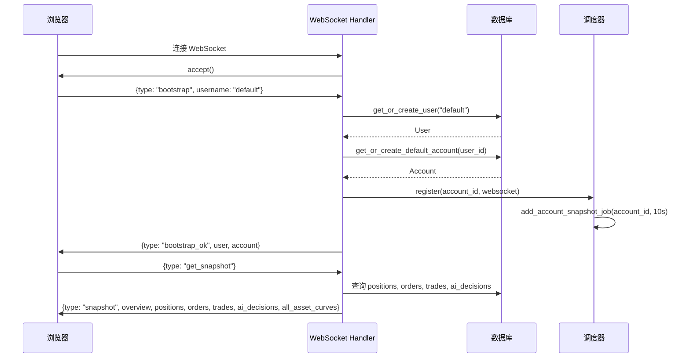
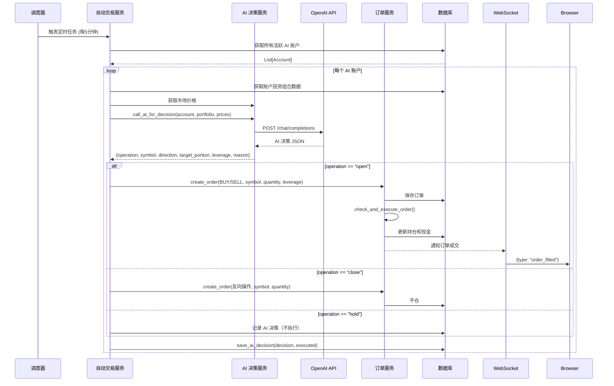
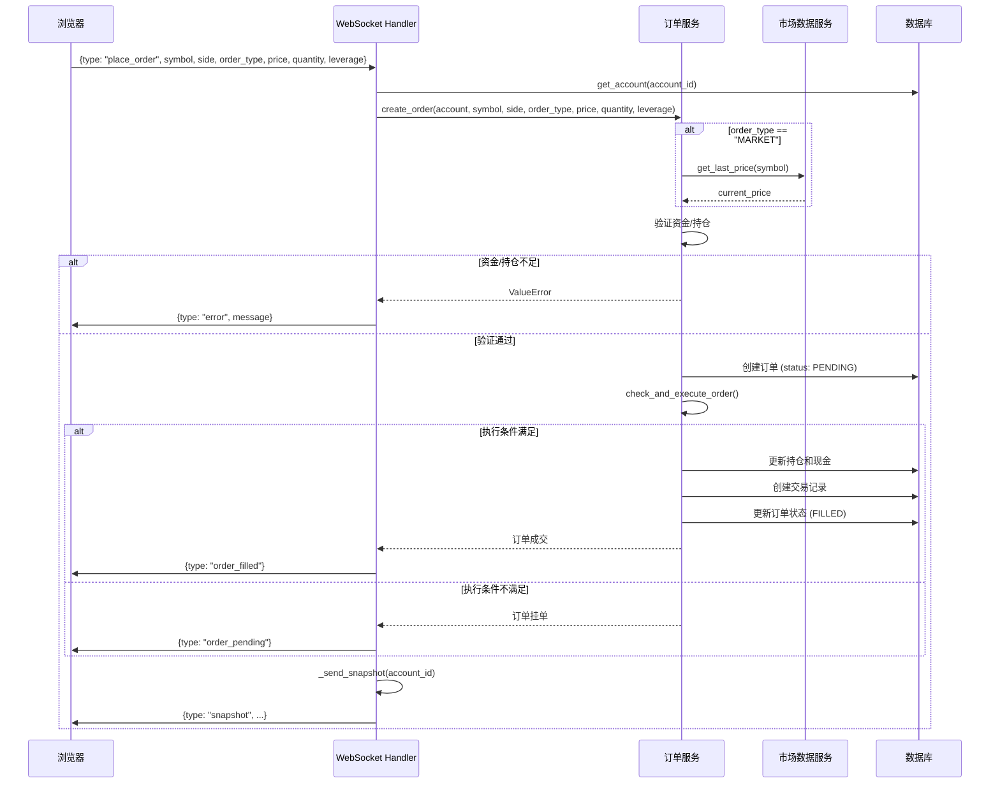
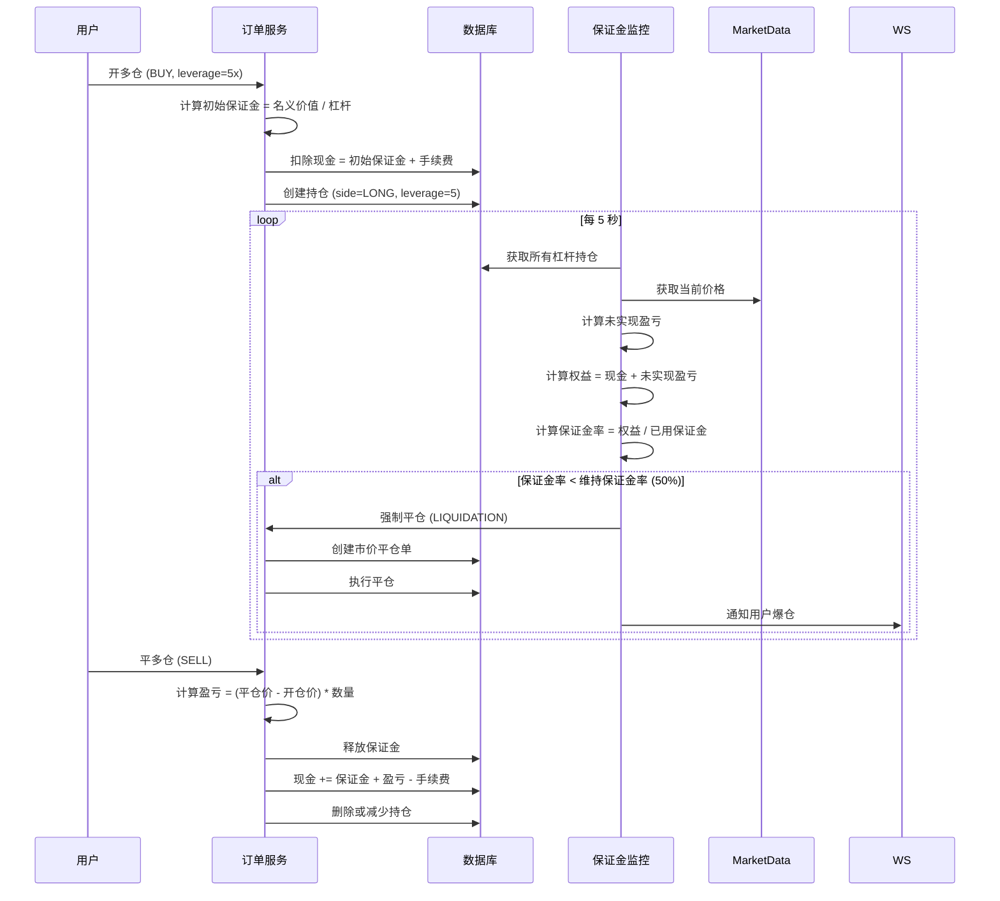
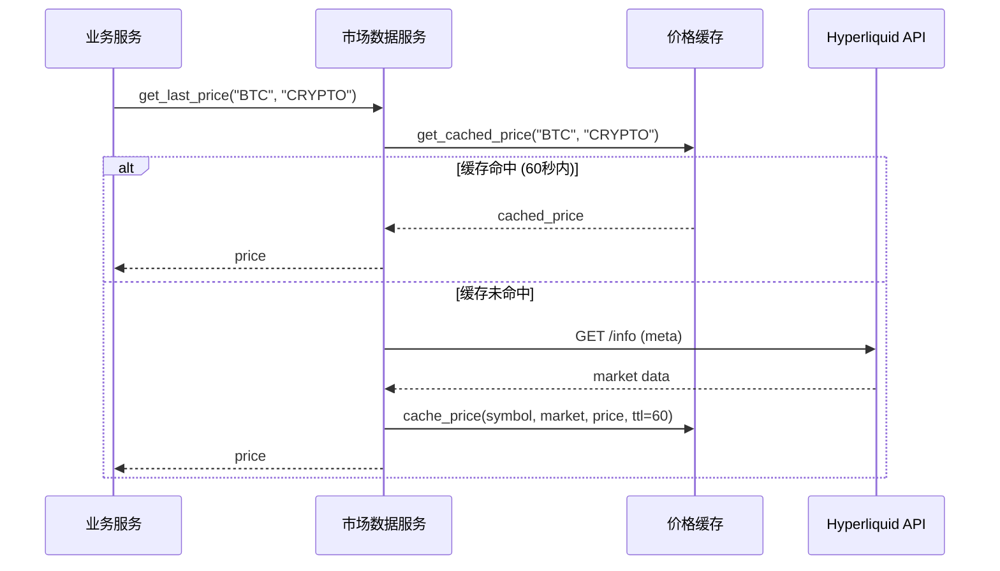
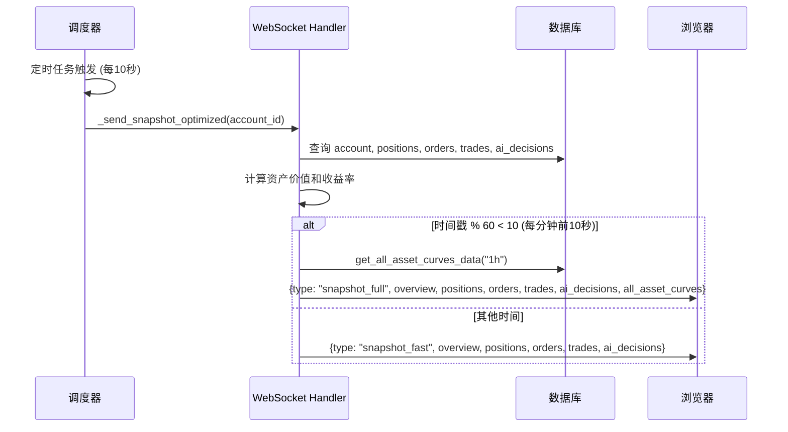

# nofx 架构文档

## 项目概述

nofx 是一个受 [nof1 Alpha Arena](https://nof1.ai) 启发的加密货币 AI 交易模拟平台。该项目允许用户设置 AI 交易机器人在加密货币市场上进行模拟交易（Paper Trading），支持杠杆交易、OpenAI 兼容 API 集成，并通过实时数据进行自动化交易决策。

### 核心特性
- ✅ 模拟交易（Paper Trading）
- ✅ OpenAI 兼容 API 集成
- ✅ 杠杆交易支持（最高 50x）
- ✅ 实时市场数据（通过 Hyperliquid）
- ✅ 多账户管理
- ✅ 实时 WebSocket 数据推送
- 🚧 真实交易（计划中）

---

## 系统架构概览

### 整体架构图

```
┌─────────────────────────────────────────────────────────────────────┐
│                           用户浏览器                                  │
│  ┌────────────────────────────────────────────────────────────────┐ │
│  │                      React Frontend                             │ │
│  │  - Portfolio View (投资组合视图)                                 │ │
│  │  - Trading Panel (交易面板)                                      │ │
│  │  - Asset Curve (资产曲线)                                        │ │
│  │  - AI Decision Log (AI决策日志)                                  │ │
│  └────────────────────────────────────────────────────────────────┘ │
│           │                                    │                      │
│           │ WebSocket (实时数据)                │ REST API (配置/查询) │
│           ▼                                    ▼                      │
└───────────────────────────────────────────────────────────────────────┘
            │                                    │
            │                                    │
┌───────────┴────────────────────────────────────┴───────────────────────┐
│                        FastAPI Backend                                 │
│  ┌──────────────────────────────────────────────────────────────────┐ │
│  │                      API Layer                                    │ │
│  │  - WebSocket Handler (ws.py)                                     │ │
│  │  - REST Routes (order_routes, account_routes, etc.)             │ │
│  └──────────────────────────────────────────────────────────────────┘ │
│                              │                                         │
│  ┌──────────────────────────────────────────────────────────────────┐ │
│  │                    Service Layer                                  │ │
│  │  ┌─────────────┐  ┌──────────────┐  ┌────────────────────────┐  │ │
│  │  │ Auto Trader │  │ AI Decision  │  │  Order Matching        │  │ │
│  │  │  Service    │  │   Service    │  │     Service            │  │ │
│  │  └─────────────┘  └──────────────┘  └────────────────────────┘  │ │
│  │  ┌─────────────┐  ┌──────────────┐  ┌────────────────────────┐  │ │
│  │  │  Scheduler  │  │ Market Data  │  │  Asset Calculator      │  │ │
│  │  │   Service   │  │   Service    │  │      Service           │  │ │
│  │  └─────────────┘  └──────────────┘  └────────────────────────┘  │ │
│  └──────────────────────────────────────────────────────────────────┘ │
│                              │                                         │
│  ┌──────────────────────────────────────────────────────────────────┐ │
│  │                   Repository Layer                                │ │
│  │  - User Repo  - Account Repo  - Order Repo  - Position Repo      │ │
│  └──────────────────────────────────────────────────────────────────┘ │
│                              │                                         │
│  ┌──────────────────────────────────────────────────────────────────┐ │
│  │                    Database Layer                                 │ │
│  │                    SQLAlchemy ORM                                 │ │
│  └──────────────────────────────────────────────────────────────────┘ │
└────────────────────────────────────┬───────────────────────────────────┘
                                     │
                                     ▼
                          ┌──────────────────────┐
                          │   SQLite Database    │
                          │  - Users             │
                          │  - Accounts          │
                          │  - Orders            │
                          │  - Positions         │
                          │  - Trades            │
                          │  - AI Decision Logs  │
                          └──────────────────────┘

┌─────────────────────────────────────────────────────────────────────┐
│                        外部服务集成                                    │
│  ┌──────────────────┐  ┌──────────────────┐  ┌──────────────────┐  │
│  │  Hyperliquid API │  │  OpenAI API      │  │  CoinJournal     │  │
│  │  (市场数据)       │  │  (AI决策)        │  │  (新闻数据)       │  │
│  └──────────────────┘  └──────────────────┘  └──────────────────┘  │
└─────────────────────────────────────────────────────────────────────┘
```

---

## 前端架构

### 技术栈
- **框架**: React 18 + TypeScript
- **构建工具**: Vite
- **UI 组件**: 自定义组件（基于 shadcn/ui）
- **样式**: Tailwind CSS
- **状态管理**: React Hooks (useState, useEffect)
- **通信**: WebSocket + REST API

### 前端组件结构

```
frontend/app/
├── components/
│   ├── common/
│   │   └── StockViewer.tsx          # 股票/加密货币查看器
│   ├── crypto/
│   │   └── CryptoSelector.tsx       # 加密货币选择器
│   ├── layout/
│   │   ├── Header.tsx               # 页面头部
│   │   ├── Sidebar.tsx              # 侧边栏导航
│   │   ├── AccountSelector.tsx      # 账户选择器
│   │   └── SettingsDialog.tsx       # 设置对话框
│   ├── portfolio/
│   │   ├── Portfolio.tsx            # 投资组合主视图
│   │   ├── ComprehensiveView.tsx    # 综合视图
│   │   ├── AccountDataView.tsx      # 账户数据视图
│   │   └── AssetCurveWithData.tsx   # 资产曲线图表
│   ├── trading/
│   │   ├── TradingPanel.tsx         # 交易面板
│   │   ├── OrderForm.tsx            # 订单表单
│   │   ├── TradeButtons.tsx         # 交易按钮
│   │   └── AuthDialog.tsx           # 认证对话框
│   └── ui/                          # 基础 UI 组件
│       ├── button.tsx
│       ├── card.tsx
│       ├── dialog.tsx
│       └── ...
├── lib/
│   ├── api.ts                       # API 客户端
│   └── utils.ts                     # 工具函数
└── main.tsx                         # 应用入口
```

### 前端数据流

```
┌──────────────────────────────────────────────────────────────┐
│                        App Component                          │
│  - 管理全局状态（user, account, positions, orders, trades）   │
│  - WebSocket 连接管理                                         │
│  - 页面路由                                                   │
└──────────────────────────────────────────────────────────────┘
                           │
                           ├─ WebSocket 消息处理
                           │  ├─ bootstrap_ok → 初始化用户和账户
                           │  ├─ snapshot → 更新完整数据快照
                           │  ├─ snapshot_fast → 快速更新（无资产曲线）
                           │  ├─ snapshot_full → 完整更新（含资产曲线）
                           │  ├─ order_filled → 订单成交通知
                           │  ├─ order_pending → 订单挂单通知
                           │  └─ error → 错误处理
                           │
                           ├─ REST API 调用
                           │  ├─ getAccounts() → 获取账户列表
                           │  ├─ createAccount() → 创建新账户
                           │  ├─ updateAccount() → 更新账户配置
                           │  └─ getCryptoPrice() → 获取加密货币价格
                           │
                           └─ 子组件渲染
                              ├─ Header → 显示标题和账户信息
                              ├─ Sidebar → 导航和设置
                              ├─ Portfolio → 投资组合视图
                              └─ ComprehensiveView → 综合视图
```

---

## 后端架构

### 技术栈
- **框架**: FastAPI
- **ORM**: SQLAlchemy
- **数据库**: SQLite
- **任务调度**: APScheduler
- **WebSocket**: FastAPI WebSocket
- **HTTP 客户端**: requests

### 后端模块结构

```
backend/
├── api/                              # API 路由层
│   ├── ws.py                         # WebSocket 处理器
│   ├── order_routes.py               # 订单管理路由
│   ├── account_routes.py             # 账户管理路由
│   ├── market_data_routes.py         # 市场数据路由
│   ├── config_routes.py              # 配置管理路由
│   ├── crypto_routes.py              # 加密货币路由
│   └── ranking_routes.py             # 排名路由
├── services/                         # 业务逻辑层
│   ├── startup.py                    # 服务初始化
│   ├── auto_trader.py                # 自动交易服务
│   ├── ai_decision_service.py        # AI 决策服务
│   ├── trading_commands.py           # 交易命令
│   ├── order_matching.py             # 订单撮合服务
│   ├── order_executor_leverage.py    # 杠杆订单执行
│   ├── market_data.py                # 市场数据服务
│   ├── hyperliquid_market_data.py    # Hyperliquid 数据源
│   ├── scheduler.py                  # 任务调度器
│   ├── asset_calculator.py           # 资产计算服务
│   ├── asset_curve_calculator.py     # 资产曲线计算
│   ├── price_cache.py                # 价格缓存
│   ├── news_feed.py                  # 新闻数据服务
│   └── order_monitor.py              # 订单监控
├── repositories/                     # 数据访问层
│   ├── user_repo.py                  # 用户仓储
│   ├── account_repo.py               # 账户仓储
│   ├── order_repo.py                 # 订单仓储
│   ├── position_repo.py              # 持仓仓储
│   └── kline_repo.py                 # K线数据仓储
├── database/                         # 数据库层
│   ├── connection.py                 # 数据库连接
│   └── models.py                     # 数据模型
├── schemas/                          # Pydantic 模式
│   ├── user.py
│   ├── account.py
│   ├── order.py
│   └── position.py
├── config/
│   └── settings.py                   # 配置文件
└── main.py                           # 应用入口
```

---

## 核心业务流程

### 1. 用户连接与初始化流程



**关键点**：
1. 前端通过 WebSocket 连接后端
2. 发送 `bootstrap` 消息初始化用户和账户
3. 后端创建或获取默认用户和账户
4. 注册 WebSocket 连接到连接管理器
5. 启动定时快照任务（每 10 秒推送一次数据）
6. 返回初始数据快照

### 2. AI 自动交易流程



**关键点**：
1. 调度器每 5 分钟触发一次自动交易任务
2. 获取所有配置了有效 API Key 的 AI 账户
3. 为每个账户调用 AI API 获取交易决策
4. AI 返回操作类型（开仓/平仓/持有）、标的、方向、仓位比例、杠杆等
5. 根据 AI 决策创建订单并执行
6. 记录 AI 决策日志到数据库
7. 通过 WebSocket 实时推送更新到前端

### 3. 手动下单流程



**关键点**：
1. 用户在前端填写订单信息并提交
2. 通过 WebSocket 发送 `place_order` 消息
3. 后端验证账户和资金/持仓
4. 创建订单记录（状态：PENDING）
5. 立即检查执行条件：
   - 市价单：立即执行
   - 限价单：检查价格条件
6. 如果条件满足，更新持仓、现金、创建交易记录
7. 推送订单状态和最新快照到前端

### 4. 杠杆交易流程



**关键点**：
1. 开仓时只需支付初始保证金（名义价值 / 杠杆）
2. 持仓记录包含 `side` (LONG/SHORT) 和 `leverage` 字段
3. 保证金监控器每 5 秒检查一次所有杠杆持仓
4. 计算实时权益和保证金率
5. 如果保证金率低于维持保证金率（50%），触发强制平仓
6. 平仓时计算盈亏并释放保证金

### 5. 市场数据获取流程



**关键点**：
1. 所有市场数据请求先检查缓存
2. 缓存有效期 60 秒，减少 API 调用
3. 使用 Hyperliquid API 作为数据源
4. 支持实时价格、K线数据、市场状态查询
5. 价格缓存定期清理（每 2 分钟）

### 6. 实时数据推送流程




**关键点**：
1. 每个连接的账户都有独立的定时快照任务
2. 快照任务每 10 秒执行一次
3. 为了性能优化，资产曲线数据只在每分钟的前 10 秒推送
4. 其他时间推送快速快照（不含资产曲线）
5. 客户端断开连接时自动移除定时任务


### 6. 交易流程
AI决策 → 计算订单参数 → 获取Hyperliquid价格 → 数据库记录交易 → 更新持仓
                                ↑
                          只读取价格数据
                          不执行真实交易
---

## 数据库设计

### ER 图

```
┌─────────────────┐
│     Users       │
├─────────────────┤
│ id (PK)         │
│ username        │
│ email           │
│ password_hash   │
│ is_active       │
│ created_at      │
│ updated_at      │
└────────┬────────┘
         │ 1
         │
         │ N
┌────────┴────────────────┐
│      Accounts           │
├─────────────────────────┤
│ id (PK)                 │
│ user_id (FK)            │
│ name                    │
│ account_type            │◄─── "AI" 或 "MANUAL"
│ model                   │◄─── AI 模型名称
│ base_url                │◄─── API 端点
│ api_key                 │◄─── API 密钥
│ initial_capital         │
│ current_cash            │
│ frozen_cash             │
│ margin_used             │◄─── 已用保证金
│ maintenance_margin_ratio│◄─── 维持保证金率
│ is_active               │
│ created_at              │
│ updated_at              │
└────────┬────────────────┘
         │ 1
         │
         ├──────────────────┐
         │ N                │ N
┌────────┴────────┐  ┌──────┴───────────┐
│   Positions     │  │     Orders       │
├─────────────────┤  ├──────────────────┤
│ id (PK)         │  │ id (PK)          │
│ account_id (FK) │  │ account_id (FK)  │
│ symbol          │  │ order_no         │
│ name            │  │ symbol           │
│ market          │  │ name             │
│ quantity        │  │ market           │
│ available_qty   │  │ side             │◄─── BUY/SELL
│ avg_cost        │  │ order_type       │◄─── MARKET/LIMIT
│ leverage        │  │ price            │
│ side            │◄─┤ quantity         │
│ accumulated_int │  │ leverage         │◄─── 杠杆倍数
│ last_int_time   │  │ filled_quantity  │
│ created_at      │  │ status           │◄─── PENDING/FILLED/CANCELLED
│ updated_at      │  │ order_time       │
└─────────────────┘  │ created_at       │
                     │ updated_at       │
                     └──────┬───────────┘
                            │ 1
                            │
                            │ N
                     ┌──────┴───────────┐
                     │     Trades       │
                     ├──────────────────┤
                     │ id (PK)          │
                     │ order_id (FK)    │
                     │ account_id (FK)  │
                     │ symbol           │
                     │ name             │
                     │ market           │
                     │ side             │
                     │ price            │
                     │ quantity         │
                     │ commission       │
                     │ taker_fee        │
                     │ interest_charged │
                     │ trade_time       │
                     └──────────────────┘

┌─────────────────────────┐
│   AIDecisionLog         │
├─────────────────────────┤
│ id (PK)                 │
│ account_id (FK)         │
│ decision_time           │
│ reason                  │◄─── AI 决策理由
│ operation               │◄─── open/close/hold
│ symbol                  │
│ prev_portion            │◄─── 之前仓位比例
│ target_portion          │◄─── 目标仓位比例
│ total_balance           │
│ executed                │◄─── 是否执行
│ order_id (FK)           │
│ leverage                │
│ created_at              │
└─────────────────────────┘

┌─────────────────────────┐
│   CryptoPrice           │
├─────────────────────────┤
│ id (PK)                 │
│ symbol                  │
│ market                  │
│ price                   │
│ price_date              │
│ created_at              │
│ updated_at              │
└─────────────────────────┘

┌─────────────────────────┐
│   CryptoKline           │
├─────────────────────────┤
│ id (PK)                 │
│ symbol                  │
│ market                  │
│ period                  │◄─── 1m/5m/15m/30m/1h/1d
│ timestamp               │
│ datetime_str            │
│ open_price              │
│ high_price              │
│ low_price               │
│ close_price             │
│ volume                  │
│ amount                  │
│ change                  │
│ percent                 │
│ created_at              │
└─────────────────────────┘
```

### 核心表说明

#### Users（用户表）
- 存储用户基本信息
- 支持密码认证（可选）
- 默认用户 `default` 用于模拟交易

#### Accounts（账户表）
- 每个用户可以有多个交易账户
- 支持 AI 账户和手动账户
- AI 账户配置：模型名称、API 端点、API 密钥
- 资金管理：初始资金、当前现金、冻结资金、已用保证金

#### Positions（持仓表）
- 记录用户的加密货币持仓
- 支持杠杆持仓（`leverage` 字段）
- 区分做多/做空（`side` 字段：LONG/SHORT）
- 累计利息和最后计息时间

#### Orders（订单表）
- 记录所有订单（市价单、限价单）
- 订单状态：PENDING（待成交）、FILLED（已成交）、CANCELLED（已取消）
- 支持杠杆交易（`leverage` 字段）

#### Trades（交易记录表）
- 记录每笔成交的详细信息
- 包含手续费、利息等费用

#### AIDecisionLog（AI 决策日志表）
- 记录 AI 的每次决策
- 包含决策理由、操作类型、目标仓位等
- 关联执行的订单（如果有）

---

## 外部服务集成

### 1. Hyperliquid API（市场数据）

```python
# 获取实时价格
GET https://api.hyperliquid.xyz/info
Body: {"type": "meta"}

# 获取 K 线数据
GET https://api.hyperliquid.xyz/info
Body: {"type": "candleSnapshot", "req": {"coin": "BTC", "interval": "1h", "startTime": timestamp, "endTime": timestamp}}
```

**集成方式**：
- `backend/services/hyperliquid_market_data.py` 封装 API 调用
- 使用 `requests` 库发送 HTTP 请求
- 支持价格查询、K线数据、市场状态查询
- 实现价格缓存机制（60秒 TTL）

### 2. OpenAI Compatible API（AI 决策）

```python
POST {base_url}/chat/completions
Headers:
  Authorization: Bearer {api_key}
  Content-Type: application/json
Body:
{
  "model": "gpt-4",
  "messages": [
    {
      "role": "user",
      "content": "You are a cryptocurrency trading AI..."
    }
  ],
  "temperature": 0.7,
  "max_tokens": 1000
}
```

**集成方式**：
- `backend/services/ai_decision_service.py` 封装 AI 调用
- 支持任何 OpenAI 兼容的 API（OpenAI、Claude、本地模型等）
- 构造包含投资组合、市场价格、新闻的 Prompt
- 解析 AI 返回的 JSON 决策
- 实现重试机制和错误处理

### 3. CoinJournal API（新闻数据）

```python
GET https://coinjournal.net/news/
# 解析 HTML 获取最新加密货币新闻
```

**集成方式**：
- `backend/services/news_feed.py` 实现新闻抓取
- 使用 BeautifulSoup 解析 HTML
- 提取新闻标题和链接
- 将新闻摘要提供给 AI 作为决策参考

---

## 定时任务调度

### 调度器架构

```python
# backend/services/scheduler.py
class TaskScheduler:
    - scheduler: BackgroundScheduler (APScheduler)
    - add_account_snapshot_task(account_id, interval=10s)
    - add_margin_monitor_task(interval=5s)
    - add_interval_task(task_func, interval, task_id)
```

### 定时任务列表

| 任务名称 | 触发频率 | 功能描述 |
|---------|---------|---------|
| **账户快照任务** | 每 10 秒 | 为每个连接的账户推送数据快照 |
| **AI 自动交易任务** | 每 5 分钟 | 调用 AI API 获取决策并执行交易 |
| **保证金监控任务** | 每 5 秒 | 检查杠杆持仓的保证金率，触发强制平仓 |
| **价格缓存清理任务** | 每 2 分钟 | 清理过期的价格缓存 |
| **订单撮合任务** | 按需触发 | 检查限价单的执行条件 |

### 任务生命周期

```
应用启动
  ↓
initialize_services()
  ↓
start_scheduler() ──→ 启动 APScheduler
  ↓
setup_market_tasks() ──→ 设置市场相关任务
  ↓
reset_auto_trading_job() ──→ 启动 AI 自动交易任务
  ↓
start_margin_monitor() ──→ 启动保证金监控任务
  ↓
运行中...
  ↓
WebSocket 连接建立 ──→ add_account_snapshot_job(account_id)
  ↓
WebSocket 连接断开 ──→ remove_account_snapshot_job(account_id)
  ↓
应用关闭
  ↓
shutdown_services()
  ↓
stop_scheduler() ──→ 停止所有任务
```

---

## 性能优化策略

### 1. 价格缓存
- **问题**：频繁调用外部 API 导致延迟和限流
- **方案**：实现内存缓存，TTL 60 秒
- **效果**：减少 90% 以上的 API 调用

### 2. 快照优化
- **问题**：每 10 秒推送完整数据导致性能瓶颈
- **方案**：
  - 实现 `snapshot_fast`（不含资产曲线）
  - 实现 `snapshot_full`（含资产曲线，每分钟推送一次）
- **效果**：减少 CPU 和数据库负载

### 3. 批量价格获取
- **问题**：为每个持仓单独获取价格效率低
- **方案**：先收集所有唯一标的，批量获取价格，再分配给持仓
- **效果**：减少重复的 API 调用

### 4. WebSocket 连接管理
- **问题**：React StrictMode 导致重复连接
- **方案**：使用模块级单例 WebSocket
- **效果**：避免重复连接和资源泄漏

---

## 安全性设计

### 1. 认证与授权
- **用户认证**：支持用户名密码认证
- **会话管理**：基于 Token 的会话（180 天有效期）
- **交易密码**：首次交易时设置，后续交易需验证

### 2. 资金安全
- **模拟交易**：所有交易都是模拟的，不涉及真实资金
- **资金验证**：下单前严格验证可用资金和持仓
- **冻结机制**：限价单创建时冻结资金，成交或取消时释放

### 3. API 密钥保护
- **存储**：API 密钥存储在数据库中（生产环境应加密）
- **传输**：通过 HTTPS 传输（生产环境）
- **展示**：前端展示时脱敏处理

### 4. 风险控制
- **保证金监控**：实时监控杠杆持仓的保证金率
- **强制平仓**：保证金率低于维持保证金率时自动平仓
- **杠杆限制**：最高 50 倍杠杆

---

## 部署架构

### Docker 部署

```yaml
# docker-compose.yml
services:
  app:
    build: .
    ports:
      - "5611:5611"
    volumes:
      - ./data:/app/data  # 持久化数据库
    networks:
      - traefik
```

### 部署流程

```bash
# 1. 安装依赖
pnpm run install:all

# 2. 构建前端
pnpm run build

# 3. 构建 Docker 镜像
docker build -t open-alpha-arena .

# 4. 启动容器
docker-compose up -d
```

### 生产环境配置

- **反向代理**：使用 Traefik 处理 HTTPS 和域名
- **数据持久化**：挂载 `./data` 目录保存数据库
- **日志管理**：容器日志输出到标准输出
- **环境变量**：通过环境变量配置敏感信息

---

## 技术栈总结

### 前端
| 技术 | 版本 | 用途 |
|------|------|------|
| React | 18.x | UI 框架 |
| TypeScript | 5.x | 类型安全 |
| Vite | 5.x | 构建工具 |
| Tailwind CSS | 3.x | 样式框架 |
| WebSocket API | - | 实时通信 |

### 后端
| 技术 | 版本 | 用途 |
|------|------|------|
| Python | 3.10+ | 编程语言 |
| FastAPI | 0.x | Web 框架 |
| SQLAlchemy | 2.x | ORM |
| SQLite | 3.x | 数据库 |
| APScheduler | 3.x | 任务调度 |
| requests | 2.x | HTTP 客户端 |

### 外部服务
| 服务 | 用途 |
|------|------|
| Hyperliquid API | 加密货币市场数据 |
| OpenAI API | AI 交易决策 |
| CoinJournal | 加密货币新闻 |

---

## 未来规划

### 短期目标
- [ ] 支持更多加密货币交易对
- [ ] 优化 AI Prompt，提高决策质量
- [ ] 添加更多技术指标和因子
- [ ] 实现回测功能

### 长期目标
- [ ] 支持真实交易（连接交易所 API）
- [ ] 多用户竞技排名系统
- [ ] 社区分享和策略市场
- [ ] 移动端应用

---

## 常见问题

### 1. 如何配置 AI 账户？
在设置中创建新账户，选择账户类型为 "AI"，填写 AI 模型名称、API 端点和 API 密钥。

### 2. 杠杆交易如何计算盈亏？
- **做多盈亏** = (平仓价 - 开仓价) × 数量 × 杠杆
- **做空盈亏** = (开仓价 - 平仓价) × 数量 × 杠杆

### 3. 什么时候会被强制平仓？
当保证金率（权益 / 已用保证金）低于维持保证金率（50%）时，系统会自动强制平仓。

### 4. 如何切换账户？
点击页面右上角的账户选择器，选择要切换的账户。

### 5. 数据多久更新一次？
- **实时数据**：每 10 秒推送一次
- **资产曲线**：每分钟更新一次
- **AI 决策**：每 5 分钟执行一次

---

## 贡献指南

欢迎贡献代码！请遵循以下步骤：

1. Fork 本仓库
2. 创建特性分支 (`git checkout -b feature/AmazingFeature`)
3. 提交更改 (`git commit -m 'Add some AmazingFeature'`)
4. 推送到分支 (`git push origin feature/AmazingFeature`)
5. 开启 Pull Request

---

## 许可证

MIT License

---

## 联系方式

- **GitHub**: https://github.com/etrobot/open-alpha-arena
- **Issues**: https://github.com/etrobot/open-alpha-arena/issues

---

*本文档最后更新时间：2025-11-02*

